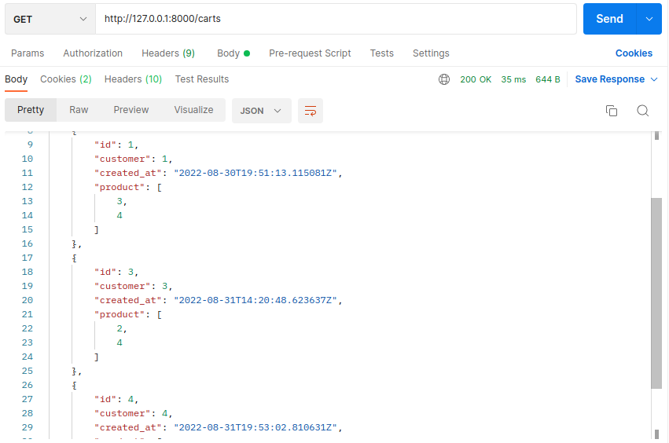

<h1 align=center>Bit68</h1>

## Requirements
## 1. Python Requirements
1. clone this repo
2. cd into repo root folder
3. `pip install -r requirements.txt`


## 2. Database Requirements
1. create new database with the following credential 
```json
{
  "NAME": "Bit68",
  "HOST": "localhost",
  "USER": "postgres",
  "PASSWORD": "123456",
  "PORT": 5432
}
```


## 3. Migration Requirements
1. start postgres service by run this `service postgres start`
2. cd into repo root folder
3. active your venv (if you have)
4. run this commands 
```bash
python3 manage.py makemigrations
python3 manage.py migrate
python3 manage.py runserver
```
    

# Endpoints

## 1. Registration


 ``` diff 
 + http://127.0.0.1:8000/user/register/
 ```
- response
  
  ```json
  [
      {
          "username": "admin",
          "password": "pbkdf2_sha256$320000$Bhf503wIWT4EhqvwYX56xA$20iLsvSCT1nNIqbTUqI27P+Ds871x3v0+U7mxAk/Ou0=",
          "email": "admin@admin.com"
      },
      {
          "username": "gihyjukiby",
          "password": "Vero ducimus nostru",
          "email": "dezo@mailinator.com"
      },
      {
          "username": "megynupi",
          "password": "pbkdf2_sha256$320000$Zf6bN7OqBxfZcSrrSisIG7$SjopuaBrJyFNadD6S+6QQEJ14KRaDFIsDujcGcoJBdA=",
          "email": "xaxulujaxo@mailinator.com"
      },
      {
          "username": "zehiqejef",
          "password": "pbkdf2_sha256$320000$qK52DICq0Sj5ofWIoqwQgn$KS5aHqrah5oQq8urs2JNZT234ZAuu+Vhc9H7qGaKUQU=",
          "email": "myfymecahy@mailinator.com"
      }
  ]
  ```
  
</details>


### 1.2 register POST

 ``` diff 
 + http://127.0.0.1:8000/api/register/
 ```

- body
  ```json
  {
    "username": "admin",
    "email": "admin@gmail.com",
    "password": "admin"
  }
  ```
- response
  ```json
  {
    "user": {
        "id": 7,
        "username": "admin",
        "email": "admin@gmail.com"
    },
    "token": "eff481de56e5843d00718263c49434a9ae8023fe49ce884e1181bdc217d47dec"
  }
  ```
 
 

 

### 1.3 login POST

 ``` diff 
 ! http://127.0.0.1:8000/user/login
 ```
- body
  ```json
  {
      "username": "admin",
      "password": "admin"
  }
  ```

- response
  ```json
  {
    "expiry": "2022-09-02T01:57:59.116242Z",
    "token": "b3d061fd8f3e2933f115b1881dd18eb0d07ecfdc01ea118f6676717b11857307"
  }
  ```
  
  

  
<br>


### 3. get all products GET

 ``` diff 
 + http://127.0.0.1:8000/products/
 ```
-  response
  ```json
    [
    {
        "id": 1,
        "name": "oppo",
        "price": "300.00",
        "date_added": "2022-08-30T19:50:35.291240Z"
    },
    {
        "id": 2,
        "name": "galaxy",
        "price": "500.00",
        "date_added": "2022-08-30T19:50:46.977383Z"
    },
    {
        "id": 5,
        "name": "lenovo",
        "price": "1700.00",
        "date_added": "2022-08-31T19:39:41.807699Z"
    },
    {
        "id": 3,
        "name": "hp",
        "price": "2000.00",
        "date_added": "2022-08-30T19:50:54.770800Z"
    },
    {
        "id": 4,
        "name": "dell",
        "price": "2500.00",
        "date_added": "2022-08-30T19:51:02.210677Z"
    }
  ]
  ```


### 4. add product POST

 ``` diff 
 ! http://127.0.0.1:8000/product/list/
 ```
- body
  ```json
  {
      "name":"oranges",
      "seller": 2,
      "price":500
  }
  ```

- response
  ```json
  {
      "id": 6,
      "name": "oranges",
      "price": 500.0,
      "seller": 2
  }
  ```
  
  

  

### 5. get product by name GET

 ``` diff 
 + http://127.0.0.1:8000/products/hp/
 ```
- response
  ```json
  {
    "id": 3,
    "name": "hp",
    "price": "2000.00",
    "date_added": "2022-08-30T19:50:54.770800Z"
  }
  ```
  
  

  
### 6. get Carts GET

 ``` diff 
 + http://127.0.0.1:8000/carts
 ```
- response
  ```json
  [
    {
        "id": 2,
        "customer": 2,
        "created_at": "2022-08-30T19:52:46.660612Z",
        "product": []
    },
    {
        "id": 1,
        "customer": 1,
        "created_at": "2022-08-30T19:51:13.115081Z",
        "product": [
            3,
            4
        ]
    },
    {
        "id": 3,
        "customer": 3,
        "created_at": "2022-08-31T14:20:48.623637Z",
        "product": [
            2,
            4
        ]
    }
  ]
  ```
  
  


### 7. post your cart Post

 ``` diff 
 + http://127.0.0.1:8000/carts

 ```
  - body
  ```json
  {
    "customer": 4,
    "product": [2,5]
  }
  
  ```

- response
  ```json
  {
    "id": 4,
    "customer": 4,
    "created_at": "2022-08-31T19:53:02.810631Z",
    "product": [
        2,
        5
    ]
  }
  ```
  
  


### 8. get Orders GET

 ``` diff 
 + http://127.0.0.1:8000/orders
 ```
- response
  ```json
  [
    {
        "id": 1,
        "customer": 1,
        "created_at": "2022-08-30T19:51:37.614547Z",
        "cart": 1
    },
    {
        "id": 2,
        "customer": 2,
        "created_at": "2022-08-30T19:53:39.185477Z",
        "cart": 1
    },
    {
        "id": 3,
        "customer": 2,
        "created_at": "2022-08-31T13:44:38.640878Z",
        "cart": 2
    }
  ]
  ```
  
  


### 9. post your order Post

 ``` diff 
 + http://127.0.0.1:8000/order

 ```
  - body
  ```json
  {
    "customer": 4,
    "cart": 5
  }
  
  ```

- response
  ```json
  {
    "id": 4,
    "customer": 4,
    "created_at": "2022-08-31T19:53:02.810631Z",
    "cart": 5
  }
  ```
  
  


